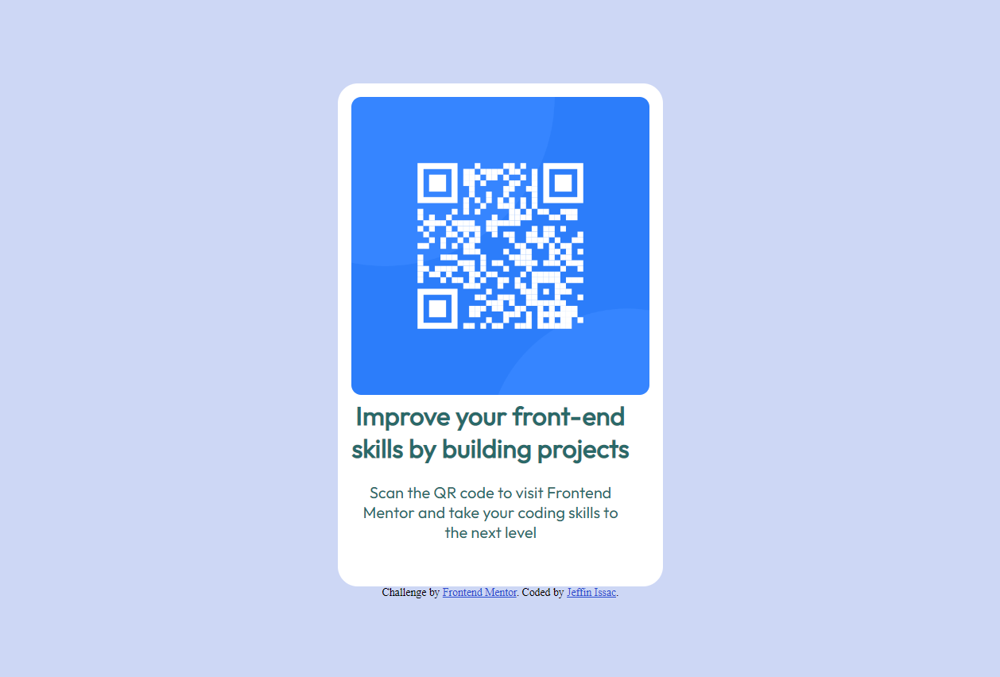

# Frontend Mentor - QR code component solution

## Overview

This is a solution to the [QR code component challenge on Frontend Mentor](https://www.frontendmentor.io/challenges/qr-code-component-iux_sIO_H). Frontend Mentor challenges help you improve your coding skills by building realistic projects.

## Table of contents

- [Overview](#overview)
  - [Screenshot](#screenshot)
  - [Links](#links)
  - [My process](#my-process)
  - [Built with](#built-with)
  - [What I learned](#what-i-learned)
  - [Continued development](#continued-development)
  - [Author](#author)

## Screenshot

## Links

- Live Site URL: [https://jeffin03.github.io/QR-CODE-VIEWER/]

## My Process

### Built with

- Semantic HTML5 markup
- CSS custom properties

### What I learned

I achieved 1% exposure into Front-end Development and understood how much more I will have to work to reskill and upskill myself.

## Author

- Frontend Mentor - [@Jeffin03](https://www.frontendmentor.io/profile/Jeffin03)
