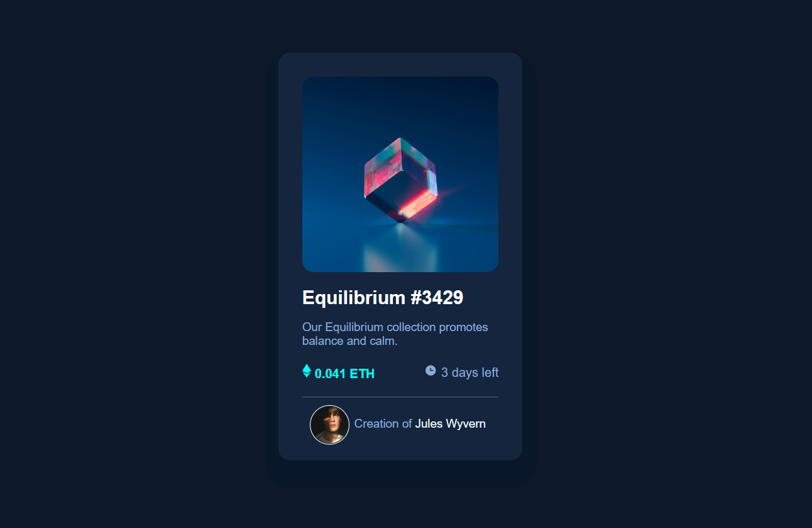

# Frontend Mentor - NFT preview card component

This is a solution to the [NFT preview card component challenge on Frontend Mentor](https://www.frontendmentor.io/challenges/nft-preview-card-component-SbdUL_w0U). Frontend Mentor challenges help you improve your coding skills by building realistic projects.

## Table of contents

- [Overview](#overview)
  - [Screenshot](#screenshot)
  - [Links](#links)
  - [My process](#my-process)
  - [Built with](#built-with)
  - [What I learned](#what-i-learned)
  - [Author](#author)

## Overview

## Screenshot



## Links

- Live Site URL: [https://jeffin03.github.io/nft-preview-card-component/]

## My Process

### Built with

- Semantic HTML5 markup
- CSS custom properties

### What I learned

- ```box-shadow``` shorthand formula.
- how to customize the ```<hr>``` tag using css.
- a deeper understanding about ```font-weights```.

## Author

- Frontend Mentor - [@Jeffin03](https://www.frontendmentor.io/profile/Jeffin03)
